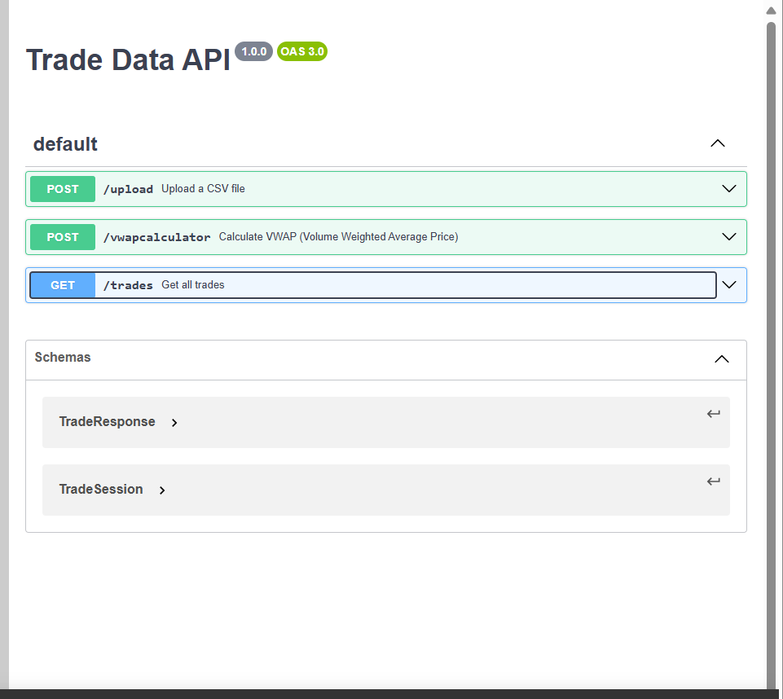
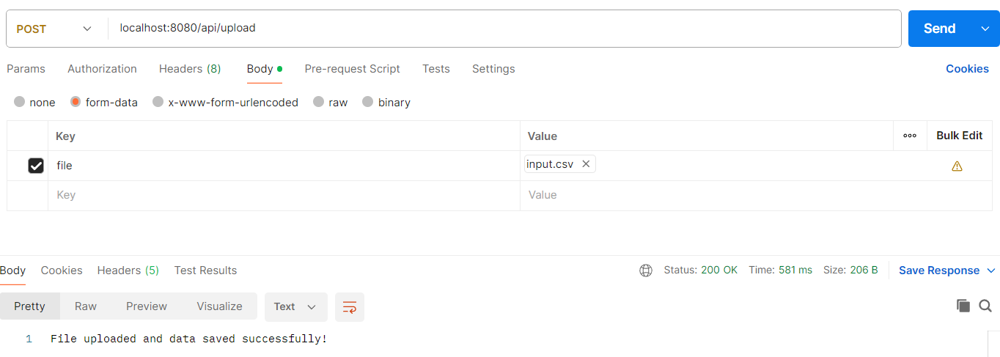
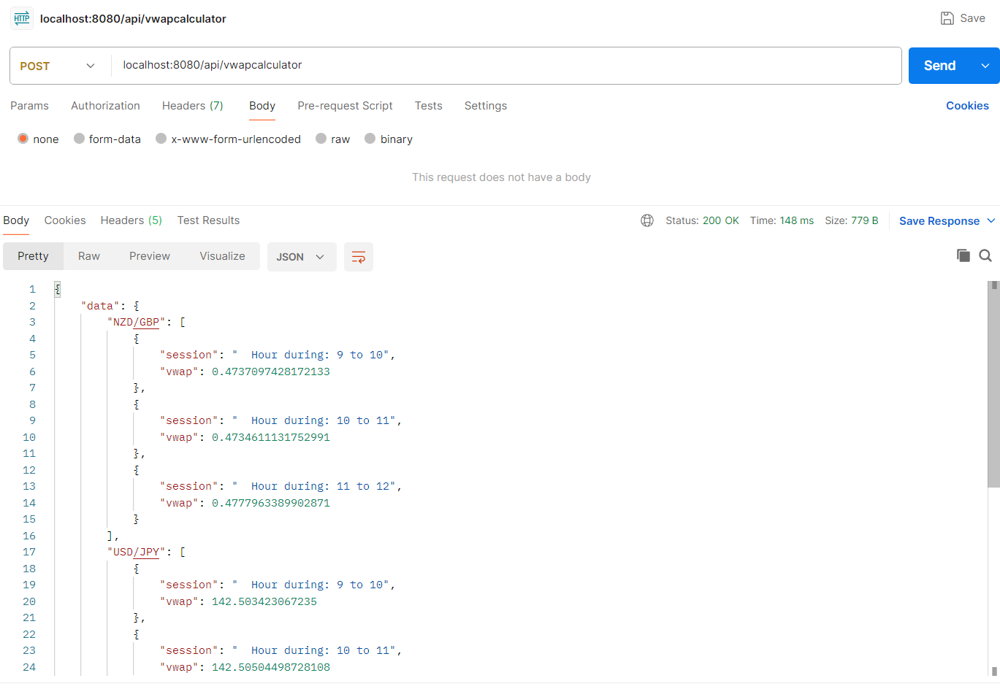

# Volume Weighted Average Pricing (VWAP) Calculator
### Description:
* This is a calculator for VWAP using spring boot framework along with required configuration.
* Given a stream of price data for multiple currency pairs in the form of:
[Timestamp, Currency-pair, Price, Volume]
* We would like the solution to output the VWAP calculated over the input stream.
* The VWAP should be calculated on an hourly window.
* The VWAP should be calculated for each unique currency pair.

### Highlights:
* It has openapi specification.
  * 
* Environment specific configuration supported by spring profile.

# Getting Started
* run command to start application on the console: 

  `mvn spring-boot:run -DskipTests -Pdev`

### Usage:
* Once application started, in the postman try accessing http://localhost:8080/api/upload
* Upload file [input.csv](src%2Fmain%2Fresources%2Finput.csv) as shown here

  
  This operation does upload stream of trades to the application which will be stored in in-memory H2 database. 
* After successful upload, now start accessing http://localhost:8080/api/vwapcalculator

  
  This is VWAP calculated output based on an hourly window, for each unique currency pair.
### Reference Documentation
For further reference, please consider the following sections:

* [Official Apache Maven documentation](https://maven.apache.org/guides/index.html)
* [Spring Boot Maven Plugin Reference Guide](https://docs.spring.io/spring-boot/3.3.5/maven-plugin)
* [Spring Web](https://docs.spring.io/spring-boot/3.3.5/reference/web/servlet.html)
* [Spring Boot DevTools](https://docs.spring.io/spring-boot/3.3.5/reference/using/devtools.html)
* [Spring Boot Actuator](https://docs.spring.io/spring-boot/3.3.5/reference/actuator/index.html)
* [Spring Data JPA](https://docs.spring.io/spring-boot/3.3.5/reference/data/sql.html#data.sql.jpa-and-spring-data)

### Guides
The following guides illustrate how to use some features concretely:

* [Building a RESTful Web Service](https://spring.io/guides/gs/rest-service/)
* [Serving Web Content with Spring MVC](https://spring.io/guides/gs/serving-web-content/)
* [Building REST services with Spring](https://spring.io/guides/tutorials/rest/)
* [Building a RESTful Web Service with Spring Boot Actuator](https://spring.io/guides/gs/actuator-service/)
* [Accessing Data with JPA](https://spring.io/guides/gs/accessing-data-jpa/)